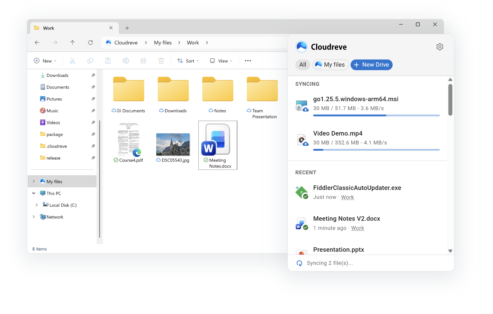

# 糖果盘桌面端



<p>
  <a href="https://apps.microsoft.com/store/detail/9p3gh5rnnzfd">
    
  </a>
</p>

A Windows desktop client for 糖果盘 cloud storage, built with Tauri and React. Provides seamless file synchronization using the Windows Cloud Files API.

## Features

- Real-time bidirectional file synchronization
- On-demand file hydration (files download only when accessed)
- Windows Explorer integration (context menus, thumbnails, custom states)
- Multiple storage provider support, aligned with the 糖果盘 server
- System tray application

## Prerequisites

### For Users

- Windows 10 version 1903 (build 18362) or later
- A 糖果盘 server instance

### For Developers

- **Windows 10/11** with [Developer Mode enabled](https://learn.microsoft.com/en-us/windows/apps/get-started/enable-your-device-for-development)
- **Rust** toolchain (install via [rustup](https://rustup.rs/))
- **Node.js** 18+ and **Yarn**
- **Windows SDK** (for MSIX packaging)

Enable Developer Mode:
```
Settings → Privacy & security → For developers → Developer Mode → On
```

Install Rust targets for cross-compilation:
```powershell
rustup target add x86_64-pc-windows-msvc
rustup target add aarch64-pc-windows-msvc
```

## Build & Run

### Quick Start (Development)

```powershell
# Install frontend dependencies
cd ui
yarn install
cd ..

# Run in development mode with hot reload
cargo tauri dev
```

### Release Build

```powershell
cargo tauri build
```

The built binary will be at `target/release/cloudreve-desktop.exe`.

The default API site used by the add-drive flow is `https://api.pan.tg`.
The user-facing authorization page is opened through `https://pan.tg`.

### OAuth Application

The desktop client uses the system OAuth app configured in the server admin panel.
Keep these values aligned with the client:

```text
应用名称: 糖果盘桌面客户端
客户端 ID: 393a1839-f52e-498e-9972-e77cc2241eee
重定向 URI: /callback/desktop
用户入口: https://pan.tg
API 入口: https://api.pan.tg
```

The app icon shown on the server authorization page can be changed in the admin panel.
The desktop client still registers the `cloudreve://` deep-link protocol for compatibility with the upstream OAuth callback flow.
Deploy `https://pan.tg/session/*` as a reverse proxy to the Cloudreve server origin, or keep the Next.js rewrites in this repository enabled.

## Development Installation (Full Feature Testing)

The basic `cargo tauri dev/build` only produces the binary. For testing **shell integration features** (context menus, thumbnails, cloud file states), you need to register the app as an MSIX package.

### Using dev-install.ps1

```powershell
# Build and register for development
.\dev-install.ps1

# Skip build if binary already exists
.\dev-install.ps1 -SkipBuild

# Use custom version
.\dev-install.ps1 -Version "0.2.0"
```

This script will:
1. Build the Tauri application (release mode)
2. Copy the binary to `package/`
3. Update `AppxManifest.xml` with correct architecture and version
4. Register the package with `Add-AppxPackage -Register`

### Unregister Development Package

```powershell
Get-AppxPackage *Tangguopan* | Remove-AppxPackage
```

## Building MSIX Packages

For distribution, use `build-msix.ps1` to create signed MSIX packages.

```powershell
# Build for both x64 and ARM64, create bundle
.\build-msix.ps1

# Build for specific architecture
.\build-msix.ps1 -Arch x64
.\build-msix.ps1 -Arch arm64

# Skip build (use existing binaries)
.\build-msix.ps1 -SkipBuild

# Custom version
.\build-msix.ps1 -Version "1.0.0"
```

Output files:
```
dist/
├── Tangguopan.x64.msix
├── Tangguopan.arm64.msix
└── Tangguopan.msixbundle
```

### Requirements for MSIX Building

- Windows SDK with `makeappx.exe` (automatically detected)
- For Store submission, packages must be signed with a certificate

## Project Structure

```
├── src-tauri/           # Tauri application shell
├── crates/
│   ├── cloudreve-sync/  # Core sync service
│   ├── cloudreve-api/   # REST client for Cloudreve server
│   └── win32_notif/     # Windows notification utilities
├── ui/                  # React frontend (Vite + MUI)
├── package/             # MSIX packaging assets
├── dev-install.ps1      # Dev build + register script
└── build-msix.ps1       # Production MSIX builder
```

## License

[MIT](LICENSE)

